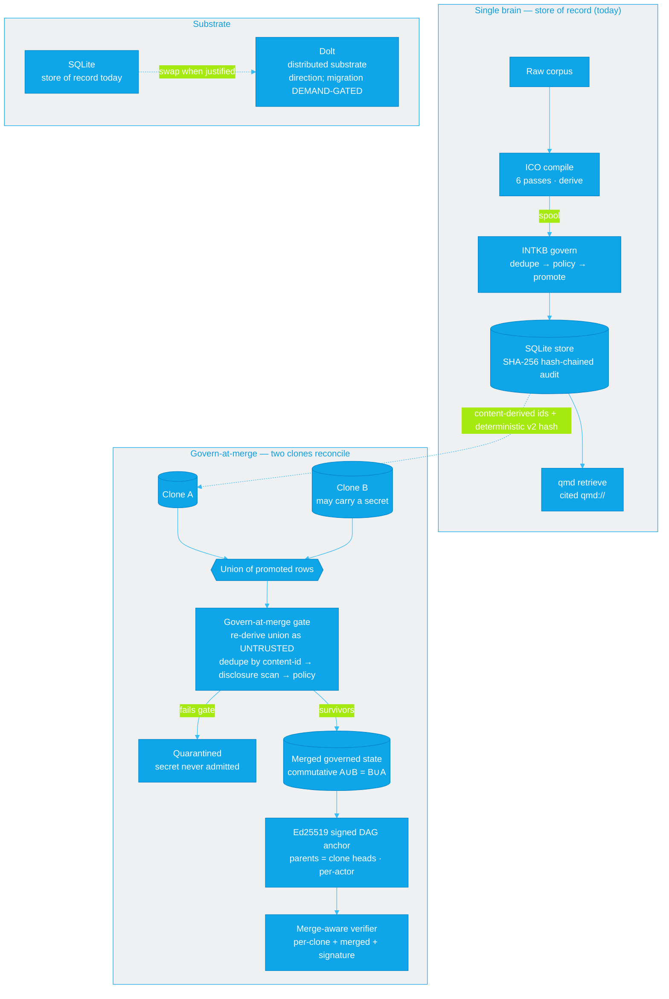

# 003-AT-SMAP — System map: the brain, and govern-at-merge

**Companion to** [002-AT-DECR](002-AT-DECR-epic1-deterministic-merge-gate.md) (the decision) and the README's high-level stack diagram. This map adds the layer the landing diagram deliberately leaves out: what happens when **two clones of a brain reconcile**.

The single-brain pipeline (compile → govern → retrieve, on SQLite) is unchanged. The new half is the **govern-at-merge** path: a merge does not trust either clone — it re-derives the *union* of their promoted rows through the same governance gate, so a secret that rode in on one clone is **quarantined**, not admitted, and the merge is signed and independently verifiable.

## How to read it

- **Single brain (top).** The pipeline from the README, on the **SQLite** store of record. Two new invariants from EPIC 1 feed the merge path (the dashed link): every row carries a **content-derived id** (same memory → same id in any clone) and the audit hash is **wallclock-deterministic** (same event → same hash anywhere).
- **Govern-at-merge (middle).** Reconciling two clones is *not* a database 3-way merge — it is a re-derivation of the **union** as **untrusted**: dedupe by content-id, then the same fail-closed disclosure scan and policy pipeline the front door uses. Failures are **quarantined**; survivors form a **commutative** merged state (`A∪B = B∪A`, byte-identical). The merged head is **Ed25519-signed** (DAG parents = the two clone heads) and checked by a **merge-aware verifier**.
- **Substrate (bottom).** Everything above runs on **SQLite today** and is substrate-agnostic. **Dolt** is the adopted *direction* for a distributed substrate, but the migration is **demand-gated** — not built until a real multiplayer need is logged. There is no distributed Dolt control-plane in production.

## Trust boundary

Cross-actor **attributable** for the merge case (a keyless forger cannot mint an accepted anchor), but still **tamper-evident, not tamper-proof** — the legitimate key-holder can re-sign. Mitigated by key custody (age/SOPS) + an external append-only anchor. See the trust-model box in [002-AT-DECR](002-AT-DECR-epic1-deterministic-merge-gate.md) and the README.
