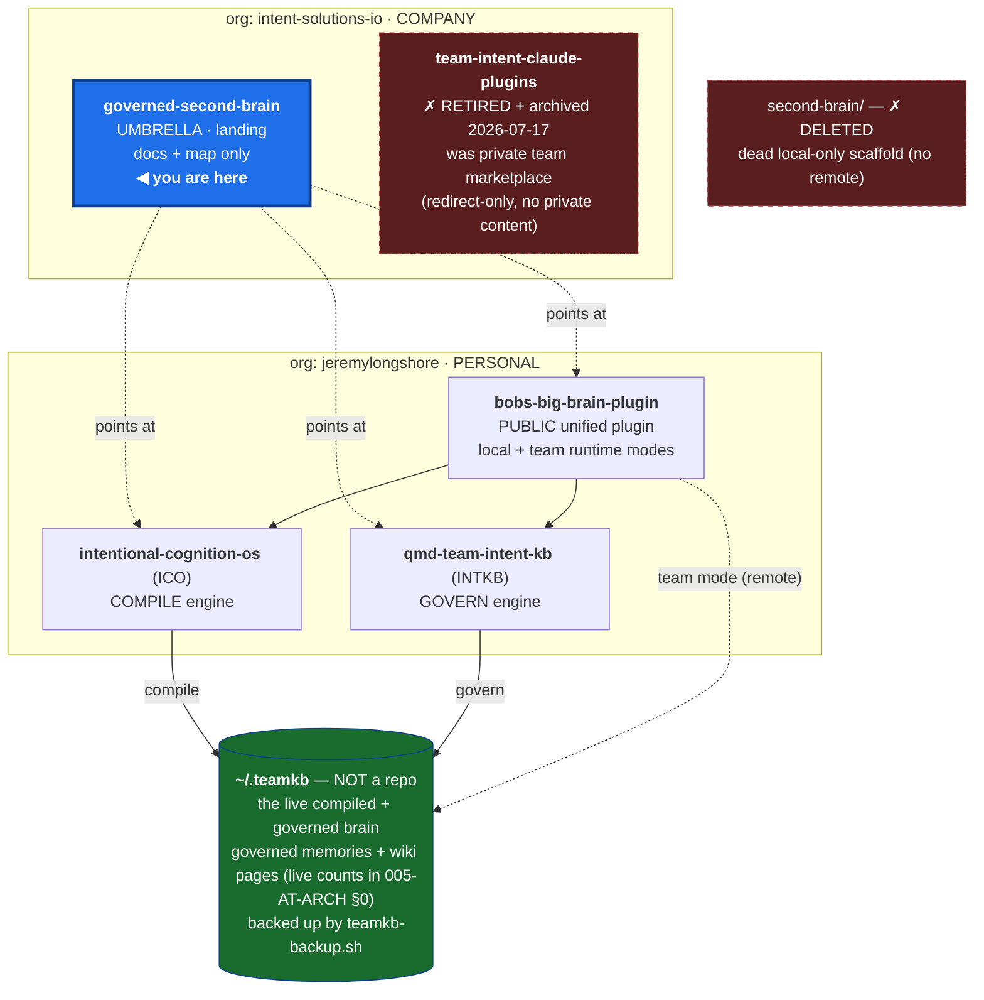

# 007-AT-SMAP — Repo topology + working surface

**What this is:** the canonical map of *which repos make up the Governed Second Brain, where each
one lives (local path **and** GitHub remote), and how they relate*. It is the durable home for the
"what's what" diagram. Companion to [`005-AT-ARCH`](005-AT-ARCH-grounded-system-map-and-backup-scope.md),
which maps *where the data lives*. **007 = which repos · 005 = where the state lives.** Two distinct
maps, deliberately split.

> **One-line orientation:** there are **4 real repos + 1 live-data directory**, spread across **2
> GitHub orgs** (the private `team-intent-claude-plugins` marketplace was **retired + archived
> 2026-07-17** — see §2). The **umbrella** (`intent-solutions-io/bobs-big-brain-umbrella`, this repo) is the
> **single working surface** — start every session here, and the `bin/gsb` helper reaches every
> sub-repo. The machine-readable version of this map is [`repos.yml`](../repos.yml) at the repo root;
> `bin/gsb` and this doc both read it.

---

## 1. The topology (diagram)

*(GitHub renders Mermaid in the web view; there is no local preview build — verify there after edits.)*

---

## 2. Local ↔ remote (the exact map)

Every dir below is directly under `~/000-projects/`. **The local dir name equals the remote
repo name for every repo.** The plugin was the last mismatch — its remote was renamed
`governed-second-brain-plugin` → `bobs-big-brain-plugin` on 2026-07-13, and its local dir was
renamed to match on 2026-07-14 (the compile/review crons, the daily backup anchor-verify, and the
`~/.claude.json` MCP path were repointed in the same pass). (An earlier mismatch — the marketplace
cloned as `intent-solutions-marketplace/` while its remote was `claude-plugins` — was fixed
2026-06-24 by renaming the remote to `team-intent-claude-plugins` and the local dir to match.)

| Local dir (`~/000-projects/`) | GitHub remote | Org | Vis | Layer / role |
|---|---|---|---|---|
| `governed-second-brain/` | `intent-solutions-io/bobs-big-brain-umbrella` | company | public | **Umbrella / landing — you are here** |
| `intentional-cognition-os/` | `jeremylongshore/intentional-cognition-os` | personal | public | **ICO** · compile engine |
| `qmd-team-intent-kb/` | `jeremylongshore/qmd-team-intent-kb` | personal | public | **INTKB** · govern engine |
| `bobs-big-brain-plugin/` | `jeremylongshore/bobs-big-brain-plugin` | personal | public | the **public unified plugin** (local + team modes) |
| ~~`team-intent-claude-plugins/`~~ | `intent-solutions-io/team-intent-claude-plugins` | company | private | **RETIRED + archived 2026-07-17** — was the private team marketplace; a redirect-only catalog whose only entry (`intent-brain`) pointed at the public plugin, so no private content. "Team" is a runtime mode of the public plugin, not a repo. Dropped from `repos.yml`. |
| `~/.teamkb/` | *(not a repo)* | — | — | **the live brain data** — one directory; backed up via `~/bin/teamkb-backup.sh` |

**Removed cruft:** `~/000-projects/second-brain/` was a **dead local-only scaffold** — empty
`.gitkeep` dirs, a single `bd init` commit, **no remote** — that also held a stale Jun-20 snapshot
of the `~/000-projects/.beads/` store. It is **not** the brain (the brain is `~/.teamkb/`). Deleted
2026-06-24 after rescuing its 7 divergent `bd_000-projects-704w` beads (a "gbrain citation-integrity
eval" epic) into the canonical store.

### Not under this umbrella (separate ecosystem — don't conflate)

`claude-code-slack-channel`, `agent-governance-plane`, and `claude-code-plugins-plus-skills` are a
**different** Intent Solutions ecosystem. They are not part of the Governed Second Brain and are not
in `repos.yml`.

### `intent-brain` — there is no standalone repo

`intent-brain` is **not** a repo in either org. It existed only as a *published entry* inside the
private `team-intent-claude-plugins` marketplace (built from `qmd-team-intent-kb/.claude-plugin/`) —
and that marketplace was **retired + archived 2026-07-17**. `intent-brain` was **folded into the
unified plugin's team mode and retired** (bead `compile-then-govern-650.4`). Don't go looking for a
repo named `intent-brain`, or for the marketplace that used to publish it.

---

## 3. Doctrine — the umbrella is the single working surface

The four repos stay **independent** (each has its own CI, releases, and visibility — collapsing them
would be wrong; e.g. the plugin ships on its own release cadence, the engines are separate). What makes the umbrella the
"one place to work from" is an **orchestration layer**, not a monorepo and **not git submodules**
(submodules add pinning / detached-HEAD pain for zero gain here):

| Surface | What it gives you |
|---|---|
| [`repos.yml`](../repos.yml) | machine-readable manifest — every repo's `local_path` / `remote` / `org` / `visibility` / `role`. Single source `bin/gsb` and this doc read. |
| [`bin/gsb`](../bin/gsb) | tiny helper over `repos.yml`: |
| `gsb map` | print this topology + each repo's branch / dirty state — instant "where am I / what's what". |
| `gsb status` | branch + dirty + ahead/behind across **all** repos at once. |
| `gsb sync` | clone any missing sub-repo to its canonical path; `git pull --rebase` the rest. On a fresh box, `gsb sync` reconstitutes the whole topology with zero manual lookup. |

**Rule of thumb:** if a session has to ask "which repo / where's the brain / where's the key," the
answer is one of: this doc (§2 for repos), `005-AT-ARCH` (for data/state), or the secrets inventory
(linked below). Get lost once, never again.

---

## 4. Cross-references

- **Where the *data/state* lives** (the other half of the map): [`005-AT-ARCH`](005-AT-ARCH-grounded-system-map-and-backup-scope.md)
  — `~/.teamkb` storage layout, the two-DB model, compile→govern→retrieve→attest flow, backup/DR scope, and the live-stats block.
- **Backup / restore runbook:** [`006-AT-RNBK`](006-AT-RNBK-brain-backup-and-restore-runbook.md).
- **Where every secret lives** (incl. the brain bearer tokens + the Cloudflare R2 backup creds):
  `~/000-projects/intentsolutions-vps-runbook/docs/secrets-inventory.md`.
- **Manifest + helper:** [`repos.yml`](../repos.yml), [`bin/gsb`](../bin/gsb).
- Program tracker: bead epic `compile-then-govern-aht` (this work) + the program GitHub issue
  `intent-solutions-io/bobs-big-brain-umbrella#1`.
