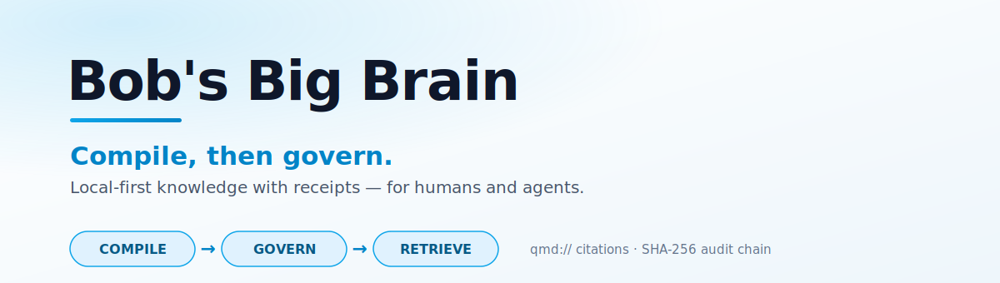
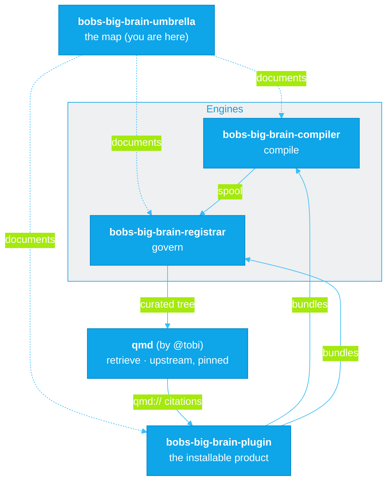
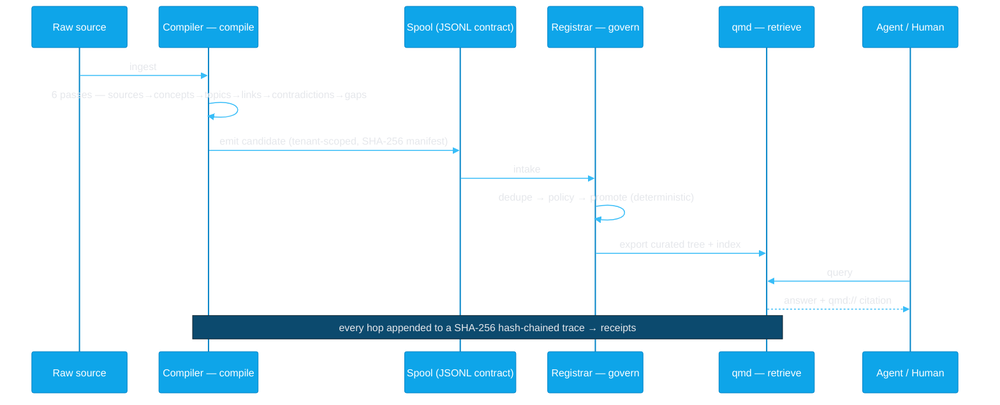
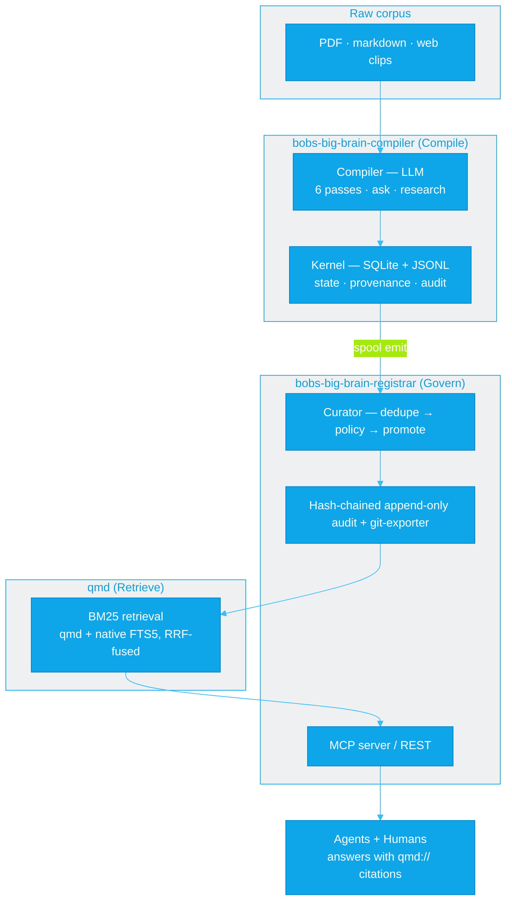

<p align="center">
  <picture>
    <source media="(prefers-color-scheme: dark)" srcset="assets/banner-dark.svg">
    
  </picture>
</p>

<h1 align="center">Bob's Big Brain</h1>

<p align="center">
  <strong>The governed team brain — cited recall, hash-chained receipts.</strong><br>
  Turn <em>your own</em> files into a governed, <code>qmd://</code>-cited team brain with a tamper-evident audit trail — for humans and agents.<br>
  <strong>Compile, then govern.</strong> Local by default; remote sharing is your opt-in.
</p>

<p align="center">
  <a href="https://github.com/jeremylongshore/bobs-big-brain-compiler/actions/workflows/ci.yml"></a>
  <a href="https://github.com/jeremylongshore/bobs-big-brain-registrar/actions/workflows/ci.yml"></a>
  <a href="https://www.npmjs.com/package/intentional-cognition-os"></a>
  
  
</p>

<p align="center">
  <strong>▸ Get the plugin:</strong>
  <a href="https://github.com/jeremylongshore/bobs-big-brain-plugin"><strong>bobs-big-brain-plugin</strong></a>
  &nbsp;&nbsp;·&nbsp;&nbsp;
  <strong>Engines:</strong>
  <a href="https://github.com/jeremylongshore/bobs-big-brain-compiler">bobs-big-brain-compiler</a> ·
  <a href="https://github.com/jeremylongshore/bobs-big-brain-registrar">bobs-big-brain-registrar</a>
</p>

---

This repo is the umbrella for the **Bob's Big Brain** stack — local-first knowledge built on the *compile, then govern* architecture. Each component is its own independently developed and released repository; this repo is where we explain **what they are, what they do, how they stack, and why they beat the alternatives.** No application code lives here — just the map.

## The 60-second version

Most "AI memory" gives an agent better **recall**. This stack does two things the category skips: it **compiles** raw corpus into derived knowledge (summaries, concepts, contradictions — not raw chunks), and it **governs** that knowledge through a deterministic pipeline before anything is trusted. Every answer ships a **receipt**: a `qmd://` citation to its source, backed by a SHA-256 hash-chained audit trail you can verify after the fact. Runs on your machine. No vector-blob lock-in.

## The problem

AI agents are getting better memory by the week. None of it answers the question that matters when something breaks: **what did the agent actually do with what it remembered, and can you prove it?**

A better memory makes an agent *recall* more. It says nothing about whether that knowledge was ever vetted, where it came from, or what the agent used at decision time. **Memory is not accountability.** Recall is table stakes. The hard problem — the one a compliance officer, an on-call engineer, or a postmortem actually needs — is the **receipt**: what was retrieved, what was used, where it came from, provable later, tamper-evident.

This stack is built around that gap.

## How we're different

The category optimizes one axis: recall. We compete on a different one: **govern + receipts.**

| Capability | Vector stores<br><sub>Pinecone · Chroma · pgvector</sub> | Agent-memory layers<br><sub>gstack/GBrain · Mem0 · Letta · Zep</sub> | **Bob's Big Brain** |
|---|:---:|:---:|:---:|
| Recall / retrieval | ✅ | ✅ | ✅ |
| **Derived** knowledge (summaries, concepts, contradictions) | ❌ raw chunks | ◑ extraction | ✅ 6 compiler passes |
| Deterministic governance (dedupe · policy · promotion) | ❌ | ❌ | ✅ |
| Provenance tracked end-to-end | ◑ | ◑ | ✅ |
| **Receipts** — tamper-evident hash-chained audit | ❌ | ❌ | ✅ SHA-256 chain |
| Inline citations on every answer | ❌ | ◑ | ✅ `qmd://` |
| Local-first / on-device | ◑ | ◑ | ✅ |
| Deterministic control plane (model proposes, system decides) | ❌ | ❌ | ✅ |

<sub>✅ first-class · ◑ partial / varies · ❌ not in the architecture. This is an architectural contrast, not a feature-by-feature audit — those tools are good at recall; we're playing a different game.</sub>

**What they offer:** fast, scalable recall — drop in embeddings, get back similar chunks (or, for the agent-memory frameworks, scored/extracted memories across turns).

**What we do better:** we don't hand the model a pile of similar chunks and hope. We *derive* knowledge, *govern* what's allowed to become durable memory with deterministic code, and *prove* every retrieval with a citation + an audit chain. The model proposes; the system decides and records.

> **On gstack / GBrain.** [gstack](https://github.com/garrytan/gstack) (Garry Tan's Claude Code harness, ~90K★) ships [GBrain](https://github.com/garrytan/gstack) as its memory layer, and it's genuinely strong at the thing it's built for: recall — top LongMemEval-S scores, ~92% fewer tokens per session, near-zero-friction capture. That's the recall axis, done well. What a memory layer doesn't do — by design, it's memory, not a control plane — is gate what becomes durable knowledge through deterministic policy, or hand you a tamper-evident receipt of what the agent actually used. *"Better memory for agents, but no receipt for what the agent did with it"* was the exact critique that kicked off this project. Bob's Big Brain is the answer: recall **and** governance **and** receipts.

## What's in the stack

| Repo | Layer | What it does |
|------|-------|--------------|
| **[bobs-big-brain-compiler](https://github.com/jeremylongshore/bobs-big-brain-compiler)** | **Compile** | Reads and organizes raw sources (npm: `intentional-cognition-os`). Ingests raw corpus (PDF / markdown / web clips) and compiles it into semantic knowledge through six passes, runs episodic research tasks, and emits a governance spool. Deterministic kernel (SQLite + JSONL) + probabilistic compiler (LLM). 5 workspace packages, Apache-2.0. |
| **[bobs-big-brain-registrar](https://github.com/jeremylongshore/bobs-big-brain-registrar)** | **Govern** | Decides what's admitted to team memory (by code) and keeps the tamper-evident record. Consumes the Compiler's spool, runs every candidate through dedupe → policy → promotion, keeps a hash-chained, by-protocol append-only audit log, and exports curated memory to a searchable tree. The deterministic control plane. 6 apps + 9 packages, Apache-2.0. |
| **[qmd](https://github.com/tobi/qmd)** (`@tobilu/qmd`) | **Retrieve** | On-device search for markdown, by [@tobi](https://github.com/tobi). The retrieval substrate. The brain's serving path is **deterministic and model-free**: qmd's keyword (BM25) results are fused with a native in-process FTS5 (BM25) backend via reciprocal-rank fusion (RRF, k=60), then freshness/category reranked — no query-time LLM call. Every hit is a `qmd://<collection>/<path>` URI — the citation. |
| **[bobs-big-brain-plugin](https://github.com/jeremylongshore/bobs-big-brain-plugin)** | **Package** | The thing you install. A local-first Claude Code + Cowork plugin that **bundles** the engines into one in-process stdio MCP server — cited search **and** governed capture (capture → govern → promote, with a hash-chained receipt), no daemon, no network. |

**Powered by [tobi/qmd](https://github.com/tobi/qmd).** We pin `@tobilu/qmd`, track bumps with Dependabot, and gate upgrades with canary + integration tests. We **do not fork** the search engine — Bob's Big Brain is the product surround (compile + govern + receipts + plugin).

**Operator tip (local team brain):** bare `qmd` uses your personal `~/.cache/qmd`. The team index lives under `~/.teamkb/qmd-index/<tenant>/`. From a [bobs-big-brain-registrar](https://github.com/jeremylongshore/bobs-big-brain-registrar) checkout: `./scripts/bbb-qmd status` (pinned `@tobilu/qmd` binary + team XDG) and `pnpm search-canary`. Full runbook: [000-docs/042-OD-OPSM-bbb-qmd-operator-runbook.md](https://github.com/jeremylongshore/bobs-big-brain-registrar/blob/main/000-docs/042-OD-OPSM-bbb-qmd-operator-runbook.md).

**How the repos fit together** — this umbrella maps them; the plugin bundles the engines; the engines + qmd form the compile → govern → retrieve pipeline. Each box is its own independently released repo:



## How it works

A single fact's journey from raw source to cited, audited answer:



**The five steps:** ingest → **compile** (derive, don't dump) → spool (the tenant-scoped JSONL contract between repos) → **govern** (dedupe/policy/promote, by code) → **retrieve** (cited, on-device). Underneath all of it, an append-only trace where each event carries the hash of the one before it.

## Architecture



**The constraint that makes it work:** *the model proposes; the deterministic system owns durable state and control.* Compilation, synthesis, and contradiction-detection are probabilistic and live in the compiler. File storage, governance, permissions, audit, and promotion rules are deterministic and live in the kernel. The model never writes durable state directly. That boundary is the whole design — it's what lets a probabilistic system produce an auditable record.

## The two flagships, up close

### The Compiler — reads and organizes

[`bobs-big-brain-compiler`](https://github.com/jeremylongshore/bobs-big-brain-compiler) (npm: `intentional-cognition-os`) is a local-first knowledge OS with a CLI (`ico`). It **derives** rather than indexes: across six passes it computes source summaries, concepts, topic pages, backlinks, contradictions, and gaps from your corpus — and keeps raw and derived strictly separate, with provenance from the first byte. Hard questions get an episodic research workspace (a five-agent collector→summarizer→skeptic→integrator→orchestrator flow) that's archived when done. When knowledge is ready to leave the building, the Compiler **emits a spool**: the tenant-scoped JSONL contract the Registrar consumes.

### The Registrar — the governance layer

[`bobs-big-brain-registrar`](https://github.com/jeremylongshore/bobs-big-brain-registrar) is the deterministic control plane for team memory. It ingests the Compiler's spool and runs every candidate through **dedupe → policy → promotion** — secret detection, trust levels, and tenant isolation all live here, enforced by code, not by a model. Promotions and rejections are written to a **hash-chained, by-protocol append-only audit log**; curated memory is exported to a category-routed markdown tree and indexed by qmd. An MCP server exposes governed, curated-only search to agents.

### qmd — the retrieval substrate

[`qmd`](https://github.com/tobi/qmd) (by [@tobi](https://github.com/tobi)) is on-device search for markdown, no API key required. We pin it, track it with Dependabot, and gate every version bump through integration tests. The delivered serving path is deliberately **deterministic and LLM-free**: we fuse qmd's keyword (BM25) results with a native in-process FTS5 (BM25) backend using reciprocal-rank fusion (RRF, k=60) — the two tokenizers catch different hits (qmd's keyword-AND misses hyphen/dot-joined terms that FTS5's `unicode61` tokenizer splits), so their union is the recall surface — then apply freshness/category reranking, with no query-time model call. Every result is a `qmd://<collection>/<path>` URI — which is exactly the citation an answer needs.

## Receipts — the part nobody else ships

This is the wedge. Three artifacts make "what did the agent know and do" provable.

**1. The spool candidate** — the Compiler's hand-off contract. Tenant-scoped, schema-versioned, content-capped, with a SHA-256 manifest:

```json
{
  "schemaVersion": "1",
  "id": "c639f0ca-47a8-51df-af06-736f03cbffc4",
  "status": "inbox",
  "source": "import",
  "title": "Transformer attention mechanism",
  "category": "architecture",
  "tenantId": "acme-team",
  "metadata": { "filePaths": ["wiki/topics/transformers.md"], "tags": ["transformer"] },
  "prePolicyFlags": { "potentialSecret": false, "lowConfidence": false, "duplicateSuspect": false },
  "capturedAt": "2026-06-01T00:00:00.000Z"
}
```

**2. The hash-chained trace** — every retrieval, promotion, and compile is one append-only JSONL event whose `prev_hash` is the SHA-256 of the previous line. Tamper with any record and the chain breaks, verifiably:

```jsonc
{ "event_type": "ask.complete", "correlation_id": "…",
  "payload": { "verifiedCitations": ["qmd://kb-curated/guides/2daed212….md"],
               "unverifiedCitations": [] },
  "prev_hash": "9f2c…" }   // prev_hash = SHA-256(previous line)
```

**3. The verifier** — a runnable primitive that walks the chain and names any break:

```console
$ ico audit verify --json
{ "ok": true, "filesScanned": 1, "totalEvents": 61, "cleanFiles": 1, "breaks": [] }
```

That's the receipt. A vector store can tell you what's *similar*. This tells you what was *used* and where it *came from* — and the hash chain **detects** any record altered or reordered after the fact.

### What the receipt does *not* do — read this before you trust it

Honesty is the whole point of a receipt, so here's the trust model, stated per mode:

| | **Local mode** (default) | **Shared / hosted mode** (your opt-in) |
|---|---|---|
| Guarantees | **Integrity + ordering + rewrite-detection** — every govern snapshots the chain head into an append-only, hash-chained anchor log committed to git; `brain_audit_verify` flags edits, deletions, reordering, **and** a silent full re-hash-forward rewrite (which the chain alone misses) | Adds **attributable, externally anchored** history once you push the anchor repo to a remote |
| Does **not** guarantee | Non-repudiation on its own: a local actor would now have to rewrite the chain, the anchor log, **and** the git history in lockstep (plus the remote's history, if you've pushed it) — much harder, and it leaves git evidence — but not impossible on a single, unshared machine | — |
| How it's closed | **Implemented:** `brain_govern` commits the chain head to a git-backed anchor log; `brain_audit_verify` / `verifyAnchors` cross-check the live chain against it. **Push that repo to a remote** for cross-actor tamper-evidence | Anchored + pushed chain head + per-actor signatures |

So: *tamper-**evident**, not tamper-proof.* The chain plus the anchor prove a record wasn't *quietly* changed — even via a full rewrite, checked against the git-committed anchors; it is **not** a blockchain, it is **not** immutable storage, and on its own it does **not** prove *who* wrote what. Within a single trust boundary — your machine — that's exactly the integrity guarantee you want. Across actors, pushing the anchor to a remote + per-actor signatures is what upgrades detection into attribution.

## Is it real? — the proof

Not a claim — a trail:

- **End-to-end, on a real corpus.** `scripts/demo-e2e.sh` drives the whole chain: compile → spool → govern → index → search → audit verify. Latest run: **7/7 stages green, 21 candidates promoted, 20 `qmd://` citations returned, 61 audit-chain events, 0 breaks.**
- **Continuously guarded.** A key-free nightly CI smoke replays the deterministic half (govern → retrieve → cite) off a frozen fixture — any regression in the chain trips a red build, with no API calls and no secrets.
- **Public dog-food trail.** The Compiler eats its own cooking against real corpora and publishes the citation-verify-rate trend over time. The metrics are public; the source content stays private.

## Getting started

**Most people want the plugin** — the packaged product that runs the whole stack locally inside Claude Code or Cowork:

→ **[jeremylongshore/bobs-big-brain-plugin](https://github.com/jeremylongshore/bobs-big-brain-plugin)** — one command: `npx governed-second-brain init <folder>` *(`--index-only` for zero egress)*

To instead see the raw chain run from source — no API key, no secrets:

```bash
# 1. clone both engines
git clone https://github.com/jeremylongshore/bobs-big-brain-compiler.git
git clone https://github.com/jeremylongshore/bobs-big-brain-registrar.git

# 2. build the Registrar (installs the pinned qmd binary)
cd bobs-big-brain-registrar && pnpm install && pnpm build && cd ..

# 3. run the deterministic half of the chain off a fixture (govern → retrieve → cite)
cd bobs-big-brain-compiler
scripts/demo-e2e.sh --from-spool dogfood/fixtures/smoke-spool
```

For the full chain (including the compile step) set `ANTHROPIC_API_KEY` and run `scripts/demo-e2e.sh`. Per-repo quickstarts live in each engine's README.

## Status

| Repo | Version | License |
|------|---------|---------|
| [bobs-big-brain-plugin](https://github.com/jeremylongshore/bobs-big-brain-plugin) (the installable product) | v1.1.2 ([npm](https://www.npmjs.com/package/governed-second-brain), SLSA-provenanced) | Apache-2.0 |
| [bobs-big-brain-compiler](https://github.com/jeremylongshore/bobs-big-brain-compiler) (npm: `intentional-cognition-os`) | v1.22.0 | Apache-2.0 |
| [bobs-big-brain-registrar](https://github.com/jeremylongshore/bobs-big-brain-registrar) | v0.8.0 | Apache-2.0 |
| [qmd](https://github.com/tobi/qmd) (upstream dependency) | 2.5.3 — pinned · Dependabot-tracked · integration-test-gated | MIT |

## Documentation

- **Ecosystem thesis** — *"Compile, Then Govern"*, peer-reviewed and Semantic-Scholar-grounded — lives byte-identical in both flagships at `000-docs/034-AT-NTRP-ecosystem-thesis.md`.
- **Build-direction decision record** — `000-docs/035-AT-DECR-post-thesis-build-direction-2026-05-23.md` (both repos).
- Per-repo architecture, standards, and ADRs live in each repo's `000-docs/`.

## License

Apache-2.0 on both flagship repos and this umbrella. See each repo's `LICENSE`. (qmd, the upstream retrieval dependency, is MIT-licensed by its author, [@tobi](https://github.com/tobi).)

---

<p align="center">
  Intent Solutions — <a href="https://intentsolutions.io">intentsolutions.io</a>
</p>
