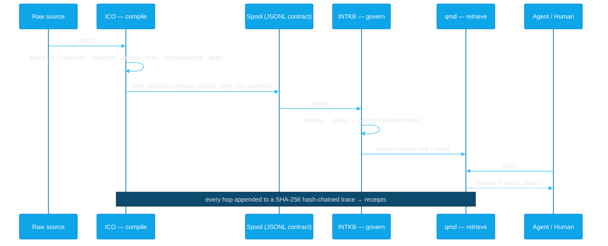
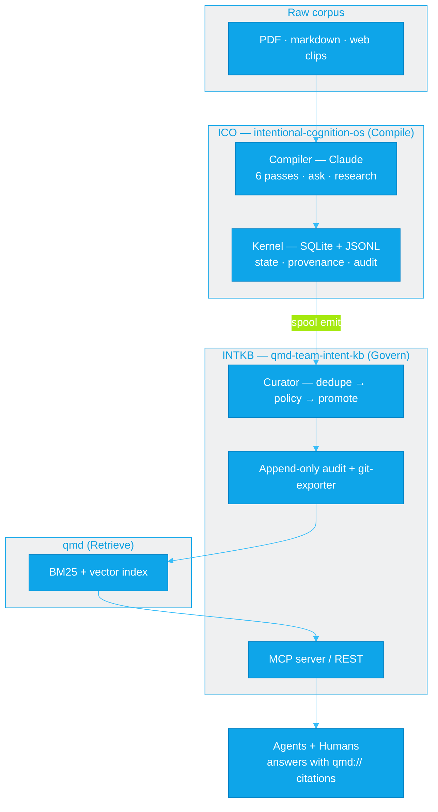

<h1 align="center">Intent Knowledge OS</h1>

<p align="center">
  <strong>Compile, then govern.</strong><br>
  A local-first knowledge stack that turns raw corpus into <em>governed, citation-backed memory</em> — with receipts — for humans and agents.
</p>

<p align="center">
  <em>Compile knowledge for the machine. Distill understanding for the human.</em>
</p>

<p align="center">
  <a href="https://github.com/jeremylongshore/intentional-cognition-os/actions/workflows/ci.yml"></a>
  <a href="https://github.com/jeremylongshore/qmd-team-intent-kb/actions/workflows/ci.yml"></a>
  <a href="https://www.npmjs.com/package/intentional-cognition-os"></a>
  
  
</p>

<p align="center">
  <strong>Live work →</strong>
  <a href="https://github.com/jeremylongshore/intentional-cognition-os">intentional-cognition-os</a> ·
  <a href="https://github.com/jeremylongshore/qmd-team-intent-kb">qmd-team-intent-kb</a>
</p>

---

This repo is the umbrella for the **Compile-Then-Govern** constellation. Each component is its own independently developed and released repository under `jeremylongshore/*`; this repo is where we explain **what they are, what they do, how they stack, and why they beat the alternatives.** No application code lives here — just the map.

## The 60-second version

Most "AI memory" gives an agent better **recall**. This stack does two things the category skips: it **compiles** raw corpus into derived knowledge (summaries, concepts, contradictions — not raw chunks), and it **governs** that knowledge through a deterministic pipeline before anything is trusted. Every answer ships a **receipt**: a `qmd://` citation to its source, backed by a SHA-256 hash-chained audit trail you can verify after the fact. Runs on your machine. No vector-blob lock-in.

## The problem

AI agents are getting better memory by the week. None of it answers the question that matters when something breaks: **what did the agent actually do with what it remembered, and can you prove it?**

A better memory makes an agent *recall* more. It says nothing about whether that knowledge was ever vetted, where it came from, or what the agent used at decision time. **Memory is not accountability.** Recall is table stakes. The hard problem — the one a compliance officer, an on-call engineer, or a postmortem actually needs — is the **receipt**: what was retrieved, what was used, where it came from, provable later, tamper-evident.

This stack is built around that gap.

## How we're different

The category optimizes one axis: recall. We compete on a different one: **govern + receipts.**

| Capability | Vector stores<br><sub>Pinecone · Chroma · pgvector</sub> | Agent-memory frameworks<br><sub>Mem0 · Letta · Zep · GBrain</sub> | **Compile-Then-Govern** |
|---|:---:|:---:|:---:|
| Recall / retrieval | ✅ | ✅ | ✅ |
| **Derived** knowledge (summaries, concepts, contradictions) | ❌ raw chunks | ◑ extraction | ✅ 6 compiler passes |
| Deterministic governance (dedupe · policy · promotion) | ❌ | ❌ | ✅ |
| Provenance tracked end-to-end | ◑ | ◑ | ✅ |
| **Receipts** — tamper-evident hash-chained audit | ❌ | ❌ | ✅ SHA-256 chain |
| Inline citations on every answer | ❌ | ◑ | ✅ `qmd://` |
| Local-first / on-device | ◑ | ◑ | ✅ |
| Deterministic control plane (model proposes, system decides) | ❌ | ❌ | ✅ |

<sub>✅ first-class · ◑ partial / varies · ❌ not in the architecture. This is an architectural contrast, not a feature-by-feature audit — those tools are good at recall; we're playing a different game.</sub>

**What they offer:** fast, scalable recall — drop in embeddings, get back similar chunks (or, for the agent-memory frameworks, scored/extracted memories across turns).

**What we do better:** we don't hand the model a pile of similar chunks and hope. We *derive* knowledge, *govern* what's allowed to become durable memory with deterministic code, and *prove* every retrieval with a citation + an audit chain. The model proposes; the system decides and records.

## What's in the stack

| Repo | Layer | What it does |
|------|-------|--------------|
| **[intentional-cognition-os](https://github.com/jeremylongshore/intentional-cognition-os)** (`ico`) | **Compile** | Local-first knowledge OS. Ingests raw corpus (PDF / markdown / web clips) and compiles it into semantic knowledge through six passes, runs episodic research tasks, and emits a governance spool. Deterministic kernel (SQLite + JSONL) + probabilistic compiler (Claude). 5 workspace packages, MIT. |
| **[qmd-team-intent-kb](https://github.com/jeremylongshore/qmd-team-intent-kb)** (INTKB) | **Govern** | Governed team-memory platform. Consumes ICO's spool, runs every candidate through dedupe → policy → promotion, keeps an append-only audit log, and exports curated memory to a searchable tree. The deterministic control plane. 6 apps + 8 packages, MIT. |
| **[qmd](https://github.com/tobi/qmd)** (`@tobilu/qmd`) | **Retrieve** | On-device hybrid search for markdown — BM25 + vector + LLM reranking, by [@tobi](https://github.com/tobi). The retrieval substrate. Every hit is a `qmd://<collection>/<path>` URI — the citation. |

## How it works

A single fact's journey from raw source to cited, audited answer:



**The five steps:** ingest → **compile** (derive, don't dump) → spool (the tenant-scoped JSONL contract between repos) → **govern** (dedupe/policy/promote, by code) → **retrieve** (cited, on-device). Underneath all of it, an append-only trace where each event carries the hash of the one before it.

## Architecture



**The constraint that makes it work:** *the model proposes; the deterministic system owns durable state and control.* Compilation, synthesis, and contradiction-detection are probabilistic and live in the compiler. File storage, governance, permissions, audit, and promotion rules are deterministic and live in the kernel. The model never writes durable state directly. That boundary is the whole design — it's what lets a probabilistic system produce an auditable record.

## The two flagships, up close

### ICO — the compiler

[`intentional-cognition-os`](https://github.com/jeremylongshore/intentional-cognition-os) is a local-first knowledge OS with a CLI (`ico`). It **derives** rather than indexes: across six passes it computes source summaries, concepts, topic pages, backlinks, contradictions, and gaps from your corpus — and keeps raw and derived strictly separate, with provenance from the first byte. Hard questions get an episodic research workspace (a five-agent collector→summarizer→skeptic→integrator→orchestrator flow) that's archived when done. When knowledge is ready to leave the building, ICO **emits a spool**: the tenant-scoped JSONL contract INTKB consumes.

### INTKB — the governance layer

[`qmd-team-intent-kb`](https://github.com/jeremylongshore/qmd-team-intent-kb) is the deterministic control plane for team memory. It ingests ICO's spool and runs every candidate through **dedupe → policy → promotion** — secret detection, trust levels, and tenant isolation all live here, enforced by code, not by a model. Promotions and rejections are written to an **append-only audit log**; curated memory is exported to a category-routed markdown tree and indexed by qmd. An MCP server exposes governed, curated-only search to agents.

### qmd — the retrieval substrate

[`qmd`](https://github.com/tobi/qmd) (by [@tobi](https://github.com/tobi)) is on-device hybrid search for markdown — BM25 + vector + LLM reranking, no API key required. We pin it, track it with Dependabot, and gate every version bump through integration tests. Every result is a `qmd://<collection>/<path>` URI — which is exactly the citation an answer needs.

## Receipts — the part nobody else ships

This is the wedge. Three artifacts make "what did the agent know and do" provable.

**1. The spool candidate** — ICO's hand-off contract. Tenant-scoped, schema-versioned, content-capped, with a SHA-256 manifest:

```json
{
  "schemaVersion": "1",
  "id": "c639f0ca-47a8-51df-af06-736f03cbffc4",
  "status": "inbox",
  "source": "import",
  "title": "Transformer attention mechanism",
  "category": "architecture",
  "tenantId": "acme-team",
  "metadata": { "filePaths": ["wiki/topics/transformers.md"], "tags": ["transformer"] },
  "prePolicyFlags": { "potentialSecret": false, "lowConfidence": false, "duplicateSuspect": false },
  "capturedAt": "2026-06-01T00:00:00.000Z"
}
```

**2. The hash-chained trace** — every retrieval, promotion, and compile is one append-only JSONL event whose `prev_hash` is the SHA-256 of the previous line. Tamper with any record and the chain breaks, verifiably:

```jsonc
{ "event_type": "ask.complete", "correlation_id": "…",
  "payload": { "verifiedCitations": ["qmd://kb-curated/guides/2daed212….md"],
               "unverifiedCitations": [] },
  "prev_hash": "9f2c…" }   // prev_hash = SHA-256(previous line)
```

**3. The verifier** — a runnable primitive that walks the chain and names any break:

```console
$ ico audit verify --json
{ "ok": true, "filesScanned": 1, "totalEvents": 61, "cleanFiles": 1, "breaks": [] }
```

That's the receipt. A vector store can tell you what's *similar*. This tells you what was *used*, where it *came from*, and proves *nobody edited the record*.

## Is it real? — the proof

Not a claim — a trail:

- **End-to-end, on a real corpus.** `scripts/demo-e2e.sh` drives the whole chain: compile → spool → govern → index → search → audit verify. Latest run: **7/7 stages green, 21 candidates promoted, 20 `qmd://` citations returned, 61 audit-chain events, 0 breaks.**
- **Continuously guarded.** A key-free nightly CI smoke replays the deterministic half (govern → retrieve → cite) off a frozen fixture — any regression in the chain trips a red build, with no API calls and no secrets.
- **Public dog-food trail.** ICO eats its own cooking against real corpora and publishes the citation-verify-rate trend over time. The metrics are public; the source content stays private.

## Getting started

The fastest way to see the chain run — no API key, no secrets:

```bash
# 1. clone both flagships
git clone https://github.com/jeremylongshore/intentional-cognition-os.git
git clone https://github.com/jeremylongshore/qmd-team-intent-kb.git

# 2. build INTKB (installs the pinned qmd binary)
cd qmd-team-intent-kb && pnpm install && pnpm build && cd ..

# 3. run the deterministic half of the chain off a fixture (govern → retrieve → cite)
cd intentional-cognition-os
scripts/demo-e2e.sh --from-spool dogfood/fixtures/smoke-spool
```

For the full chain (including ICO's compile step) set `ANTHROPIC_API_KEY` and run `scripts/demo-e2e.sh`. Per-repo quickstarts live in each flagship's README.

## Status

| Repo | Version | License |
|------|---------|---------|
| [intentional-cognition-os](https://github.com/jeremylongshore/intentional-cognition-os) | v1.10.0 | MIT |
| [qmd-team-intent-kb](https://github.com/jeremylongshore/qmd-team-intent-kb) | v0.6.0 | MIT |
| [qmd](https://github.com/tobi/qmd) (upstream dependency) | 2.5.3 — pinned · Dependabot-tracked · integration-test-gated | MIT |

## Documentation

- **Ecosystem thesis** — *"Compile, Then Govern"*, peer-reviewed and Semantic-Scholar-grounded — lives byte-identical in both flagships at `000-docs/034-AT-NTRP-ecosystem-thesis.md`.
- **Build-direction decision record** — `000-docs/035-AT-DECR-post-thesis-build-direction-2026-05-23.md` (both repos).
- Per-repo architecture, standards, and ADRs live in each repo's `000-docs/`.

## License

MIT on both flagship repos and this umbrella. See each repo's `LICENSE`.

---

<p align="center">
  Intent Solutions — <a href="https://intentsolutions.io">intentsolutions.io</a>
</p>
